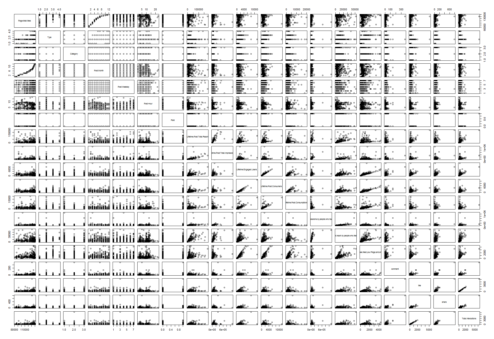

# **I**. Introduction

In this project, we will be examining a dataset [1] that contains social media information for a particular cosmetics brand. The data contains information about posts that were published on the brand's Facebook page during the year of 2014. There are approximately 500 records in this dataset (prior to any cleaning).


The information includes what would be expected from social media page metrics such as `Page total like`, `Lifetime Post Consumption`, `Total Interactions`, `Post Month`, and `Type` (see Appendix A for a complete list of variables).


We are particularly interested in the variable `Lifetime Post Consumers`. This variable gives the total number of clicks anywhere in a post over the post's lifetime. Our goal is to create a multiple regression model that explains the `Lifetime Post Consumers` variable based on the other variables.


It is widely understood that Facebook marketing is an important tool used by modern data businesses in order to create social awareness and increase revenue. For this project, we are operating under the assumption that `Lifetime Post Consumers` is a good metric for evaluating how effective a Facebook post is in achieving advertising goals. In other words, a large value for `Lifetime Post Consumers` corresponds to a high social awareness which can lead to increased revenue. Thus, it seems to be beneficial to understand how `Lifetime Post Consumers` is explained by the other variables in the dataset in an effort to increase `Lifetime Post Consumers`.


Because our goal is to explain `Lifetime Post Consumers`, we will try to find the smallest model that gives good results. We are interested in a smaller and simpler model in order to ensure the model is understandable. To do this, we will use various techniques for model selection and quality criteria. These techniques will be described in the methods section.


# **II**. Methods

```{r echo=FALSE}
original_data = read.csv("./data/dataset_Facebook.csv", header = TRUE, sep = ";")
```

```{r echo=FALSE}
# Remove incomplete records
fb_data <- original_data[complete.cases(original_data), ]
removed_count <- nrow(original_data) - nrow(fb_data)

# Convert numbers to factors
fb_data[, "Post.Month"] <- as.factor(fb_data[, "Post.Month"])
fb_data[, "Paid"] <- as.factor(fb_data[, "Paid"])

#split data
set.seed(0)
test_indicies <- sample(1:nrow(fb_data), nrow(fb_data)/2)
fb_train_data <- fb_data[-test_indicies,]
fb_test_data <- fb_data[test_indicies,]
```

Before doing any analysis, we remove all incomplete records, do some minor data type transformations, and split the data (randomly and equally) into testing and training data. 

Removing all records with incomplete (i.e., `NA`) data results in a total of `r removed_count` records being removed. We also convert `Post.Month` and `Paid` to be factors (to later use as categorical predictors).


The first step in building our model is to examine the pairs plot. This can be used to gain insight into the data. (Note: because there are many pairs in the pairs plot, it is best to open the high-resolution plot image file "Rplot01.png"" that accompanies this report, or if viewing in a web browser, open the image in a new tab and zoom in.)



By studying the plot in figure 1.1 we immediately see what appear to be several linear relationships between `Lifetime Post Consumers` and the variables `Lifetime Engaged Users`, `Lifetime Post Consumptions`, `Lifetime Post reach by people who like your Page`, and `Lifetime People who have liked your Page and engaged with your post`.

There also appears to be correlation between other (predictor) variables as well.

Because our goal is to create a model that explains the response, we will be trying to limit transformations and interactions. However, there are several categorical predictors we are interested in (with interactions). The `Type` (e.g., video, photo, etc...), `Post Month`, and  `Paid` are the categorical predictors we are most interested in. However, including all of these predictors will result in a single model that will not be very good at explanation due to high complexity. So instead of building a single model, we will build three separate models where each model uses a different categorical predictor with interaction between the categorical predictor and other variables. This will give us a better model for explanation while still giving insight into how the various categorical predictors affect the response.

###  **II.I**: Model Selection Process  

We have identified the end goal of creating a model in which the response is explained by the predictors. This means we need to find the simplest model we can that still meets the quality criteria. This is complicated by the fact that we have identified several categorical predictors that we want to incorporate into the model (thus increasing complexity).

The quality criteria which we will use to judge the models will include:
 
* Akaike information criterion (AIC)
* Bayesian information criterion (BIC)
* Leave-on-out cross-validated root mean square error (LOOCV RMSE)

If needed, we will also use ANOVA F-test to compare different models in order to help select simpler models.

Once we have selected one or more models, we will perform further analysis to evaluate the model performance and assumptions. This process includes:

* Fitted vs. residual plots (to test linearity and constant variance assumptions)
* Breusch-Pagan test (to test constant variance assumption)
* Q-Q plots (to test error distribution for normality)
* Shapiro-Wilk test (to test for error distribution normality)
* Test data root mean square error (data split into testing and training data)


We will begin the model selection by hand selecting model parameters. Reiterating that we are trying to choose a simple model that includes the categorical predictors of interest. The initial hand selected model is selected with the understanding obtained from the pairs plot (see figure 1.1) and with the simple model in mind. Thus we choose an additive model with interaction terms limited to the earlier identified categorical predictors and no transformations.

We start by creating the three additive models (one for each categorical predictor of interest) with categorical interaction terms. It is important to note here that the three models are not competing with each other. We are going to go through the selection and evaluation process for the models for each categorical predictor. We are not trying to determine the best categorical predictor, but rather use each categorical predictor to further our understanding of the response variable. For example, using `Paid` as a categorical predictor, we can see how the response relates to the numerical predictors when the post is paid and unpaid. Likewise, with the `Type` categorical predictor, we can see how the response relates to the numerical predictors when categorized by each type of post (video, link, photo, and status). The same goes for examining the response when categorized by the individual months.

The initial predictors are selected by looking at the pairs plot and choosing the values that have noticeable correlation with the response. 

We start by aliasing our variables to make the following formulas less verbose.

$x_1$ is `Lifetime Engaged Users`    
$x_2$ is `Lifetime Post Consumptions`    
$x_3$ is `Lifetime Post reach by people who like your Page`    
$x_4$ is `Lifetime People who have liked your Page and engaged with your post`    

Here is the initial model when using `Paid` as a categorical predictor with interactions:

$$    
\text{paid_model} = \beta_0 + \beta_1x_1 + \beta_2x_2  + \beta_2x_2  + \beta_4x_4 + \beta_5p_1 + \beta_6p_1x_1 + \beta_7p_1x_2 + \beta_8p_1x_3 + \beta_9p_1x_4 \\
p_1 = 1 \text{ if paid, 0 otherwise}
$$
Here is the initial model when using `Type` as the categorical predictor with interactions:
$$
\begin{aligned}
\text{type_model} &=\beta_0 + \beta_1x_1 + \beta_2x_2  + \beta_2x_2  + \beta_4x_4 + \beta_5t_{photo} \\
&+\beta_6t_{status} + \beta_7t_{video} + \beta_8x_1t_{photo} + \beta_9x_1t_{status} + \beta_{10}x_1t_{video} \\
&+ \beta_{11}x_2t_{photo} + \beta_{12}x_2t_{status} + \beta_{13}x_2t_{video} + \beta_{14}x_3t_{photo} \\
&+ \beta_{15}x_3t_{status} + \beta_{16}x_3t_{video} + \beta_{17}x_4t_{photo} + \beta_{18}x_4t_{status} + \beta_{19}x_4t_{video} \\
\end{aligned}
\\
\\
t_{photo} = 1 \text{ if Type = photo, 0 otherwise} \\
t_{status} = 1 \text{ if Type = status, 0 otherwise} \\
t_{video} = 1 \text{ if Type = video, 0 otherwise}
$$

Here is the model with `Post Month` as the categorical predictor with interactions:
$$
\begin{aligned}
\text{month_model} &= \beta_{0} + \beta_{1}x_1 + \beta_{2}x_2 + \beta_{3}x_3 + \beta_{4}x_4 + \beta_{5}m_{2}  \\
&+ \beta_{6}m_{3} + \beta_{7}m_{4} + \beta_{8}m_{5} + \beta_{9}m_{6} + \beta_{10}m_{7} + \beta_{11}m_{8} + \beta_{12}m_{9} \\
&+ \beta_{13}m_{10} + \beta_{14}m_{11} + \beta_{15}m_{12} + \beta_{16}x_1m_{2} + \beta_{17}x_2m_{2} + \beta_{18}x_3m_{2} \\
&+ \beta_{19}x_4m_{2} + \beta_{20}x_1m_{3} + \beta_{21}x_2m_{3} + \beta_{22}x_3m_{3} + \beta_{23}x_4m_{3} + \beta_{24}x_1m_{4} \\
&+ \beta_{25}x_2m_{4} + \beta_{26}x_3m_{4} + \beta_{27}x_4m_{4} + \beta_{28}x_1m_{5} + \beta_{29}x_2m_{5} + \beta_{30}x_3m_{5} \\
&+ \beta_{31}x_4m_{5} + \beta_{32}x_1m_{6} + \beta_{33}x_2m_{6} + \beta_{34}x_3m_{6} + \beta_{35}x_4m_{6} + \beta_{36}x_1m_{7} \\
&+ \beta_{37}x_2m_{7} + \beta_{38}x_3m_{7} + \beta_{39}x_4m_{7} + \beta_{40}x_1m_{8} + \beta_{41}x_2m_{8} + \beta_{42}x_3m_{8} \\
&+ \beta_{43}x_4m_{8} + \beta_{44}x_1m_{9} + \beta_{45}x_2m_{9} + \beta_{46}x_3m_{9} + \beta_{47}x_4m_{9} + \beta_{48}x_1m_{10} \\
&+ \beta_{49}x_2m_{10} + \beta_{50}x_3m_{10} + \beta_{51}x_4m_{10} + \beta_{52}x_1m_{11} + \beta_{53}x_2m_{11} + \beta_{54}x_3m_{11} \\
&+ \beta_{55}x_4m_{11} + \beta_{56}x_1m_{12} + \beta_{57}x_2m_{12} + \beta_{58}x_3m_{12} + \beta_{59}x_4m_{12}
\end{aligned} \\
\\
m_n = \text{1 if Post Month = n, 0 otherwise }, n \in [2,3,4,5,6,7,8,9,10,11,12]
$$

At first glance these model may appear over complicated for the stated goal of explaining the response variable. However, these models can be pretty easily understood simply by setting the given categorical variable to a value within its domain and then looking at the model. So even though these models appear complicated upon initial inspection, they are really not too hard to reason about. We also expect to lose numerical predictors in the model selection process because we are starting with highly correlated predictors. If our models end up becoming _more_ complex in the model selection, then we may have to rethink our model choice in order to achieve the goal of creating a model for explanation.


Now that we have defined our initial models we will use a forward and backward selection process using both the AIC and BIC criteria.

```{r message=FALSE, results="hide"}
#--------------------------------------------------
# Create the initial models (one for each categorical predictor)
#--------------------------------------------------
# Define Paid model starting formula
paid_model_starting_formula <- Lifetime.Post.Consumers ~ (Lifetime.Engaged.Users + Lifetime.Post.Consumptions + Lifetime.Post.reach.by.people.who.like.your.Page + Lifetime.People.who.have.liked.your.Page.and.engaged.with.your.post)*Paid
# Create paid model
paid_model <- lm(paid_model_starting_formula, data = fb_train_data)

# Define Type model starting formula
type_model_starting_formula <- Lifetime.Post.Consumers ~ (Lifetime.Engaged.Users + Lifetime.Post.Consumptions + Lifetime.Post.reach.by.people.who.like.your.Page + Lifetime.People.who.have.liked.your.Page.and.engaged.with.your.post)*Type
# Create type model
type_model <- lm(type_model_starting_formula, data = fb_train_data)

# Define Month model starting formula
month_model_starting_forumula <- Lifetime.Post.Consumers ~ (Lifetime.Engaged.Users + Lifetime.Post.Consumptions + Lifetime.Post.reach.by.people.who.like.your.Page + Lifetime.People.who.have.liked.your.Page.and.engaged.with.your.post)*Post.Month
# Create month model
month_model <- lm(month_model_starting_forumula, data = fb_train_data)

#--------------------------------------------------
# Use Forward AIC
#--------------------------------------------------
paid_fwd_aic_model <- step(
    lm(Lifetime.Post.Consumers ~ Paid, data = fb_train_data), 
    scope = paid_model_starting_formula, 
    direction = "forward")


type_fwd_aic_model <- step(
    lm(Lifetime.Post.Consumers ~ Type, data = fb_train_data), 
    scope = type_model_starting_formula,
    direction = "forward")


month_fwd_aic_model <- step(
    lm(Lifetime.Post.Consumers ~ Post.Month, data = fb_train_data),
    scope = month_model_starting_forumula,
    direction = "forward")

#--------------------------------------------------
# Use Forward BIC
#--------------------------------------------------
n <- nrow(fb_train_data)

paid_fwd_bic_model <- step(
    lm(Lifetime.Post.Consumers ~ Paid, data = fb_train_data), 
    scope = paid_model_starting_formula, 
    direction = "forward", k = log(n))

type_fwd_bic_model <- step(
    lm(Lifetime.Post.Consumers ~ Type, data = fb_train_data), 
    scope = type_model_starting_formula,
    direction = "forward", k = log(n))

month_fwd_bic_model <- step(
    lm(Lifetime.Post.Consumers ~ Post.Month, data = fb_train_data),
    scope = month_model_starting_forumula,
    direction = "forward", k = log(n))

#--------------------------------------------------
# Use Backward AIC
#--------------------------------------------------
paid_bwd_aic_model <- step(paid_model, direction = "backward")
type_bwd_aic_model <- step(type_model, direction = "backward")
month_bwd_aic_model <- step(month_model, direction = "backward")  

#--------------------------------------------------
# Use Backward BIC
#--------------------------------------------------
paid_bwd_bic_model <- step(paid_model, direction = "backward", k = log(n))
type_bwd_bic_model <- step(type_model, direction = "backward", k = log(n))
month_bwd_bic_model <- step(month_model, direction = "backward", k = log(n))    
```

This gives us five models for each categorical predictor (a total of 15 models) to evaluate. 

A cursory inspection shows that some of the above selection steps did not change the model, or resulted in identical models. 

* The forward BIC selection resulted in the same model as the forward AIC for the `paid_model`.  
* The backward AIC selection resulted in the same model as the starting model for the `paid_model`.  
* The backward BIC selection resulted in the same model as the backward AIC for the `type_model`.  
* The backward AIC and backward BIC selections resulted in the same model as the starting model for the `month_model`.  


After removing duplicate models from the selection process we have the following models:

For the model using the `Paid` categorical variable:   

* Starting model: `paid_model`  
* Backward BIC selection: `paid_bwd_bic_model`   
* Forward AIC selection: `paid_fwd_aic_model`   

For the model using the `Type` categorical variable:   

* Starting model: `type_model`    
* Backward AIC selection: `type_bwd_aic_model`    
* Forward AIC selection: `type_fwd_aic_model`     
* Forward BIC selection: `type_fwd_bic_model`    

For the model using the `Month` categorical variable:   

* Starting model: `month_model`    
* Forward AIC selection: `month_fwd_aic_model`   
* Forward AIC selection: `month_fwd_bic_model`     


This leaves us with only 10 models to evaluate. For each model, we will calculate the leave-one-out cross-validated (LOOCV) root mean square error (RMSE), the test data RMSE, the p-value for the Breusch-Pagan (BP) test, and the p-value Shapiro-Wilk (SW) test.


```{r}
get_model_calculations <- function(model, data, actual) {
    # Perform various model calculations.
    #
    # Args:
    #   model: An object created from the lm() function.
    #   data: The data used to create new predictions with the given model
    #   actual: The actual fitted values to compare to the predicted values
    #
    # Returns:
    #   A list with the following values: bp_test_p_val, sw_test_p_val, loocv_rmse, rmse
    
    # Get RMSE
    fitted_values <- predict(model, data)
    rmse <- sqrt(mean((fitted_values - actual)^2))
    
    # GEt LOOCV RMSE
    loocv_rmse <- sqrt(mean((resid(model) / (1 - hatvalues(model)))^2))
    
    # Get BP-Test p-value
    bp_test_p_val <- lmtest::bptest(model)$p.value
    
    # Get the SW-Test p-value
    sw_test_p_val <- shapiro.test(resid(model))$p.value

    
    retVal <- list(
        rmse = rmse,
        loocv_rmse = loocv_rmse,
        bp_test_p_val = bp_test_p_val,
        sw_test_p_val = sw_test_p_val
    )
}
```

```{r message=FALSE, warning=FALSE}


#--------------------------------------------------
# Calculations for model with Paid categorical variable
#--------------------------------------------------
paid_model_calculations <- get_model_calculations(paid_model, fb_test_data, fb_test_data$Lifetime.Post.Consumers)

paid_bwd_bic_model_calculations <- get_model_calculations(paid_bwd_bic_model, fb_test_data, fb_test_data$Lifetime.Post.Consumers)

paid_fwd_aic_model_calculations <- get_model_calculations(paid_fwd_aic_model, fb_test_data, fb_test_data$Lifetime.Post.Consumers)


#--------------------------------------------------
# Calculations for model with Type categorical variable
#--------------------------------------------------
type_model_calculations <- get_model_calculations(type_model, fb_test_data, fb_test_data$Lifetime.Post.Consumers)

type_bwd_aic_model_calculations <- get_model_calculations(type_bwd_aic_model, fb_test_data, fb_test_data$Lifetime.Post.Consumers)

type_fwd_aic_model_calculations <- get_model_calculations(type_fwd_aic_model, fb_test_data, fb_test_data$Lifetime.Post.Consumers)

type_fwd_bic_model_calculations <- get_model_calculations(type_fwd_bic_model, fb_test_data, fb_test_data$Lifetime.Post.Consumers)


#--------------------------------------------------
# Calculations for model with Post Month categorical variable
#--------------------------------------------------
month_model_calculations <- get_model_calculations(month_model, fb_test_data, fb_test_data$Lifetime.Post.Consumers)

month_fwd_aic_model_calculations <- get_model_calculations(month_fwd_aic_model, fb_test_data, fb_test_data$Lifetime.Post.Consumers)

month_fwd_bic_model_calculations <- get_model_calculations(month_fwd_bic_model, fb_test_data, fb_test_data$Lifetime.Post.Consumers)
```


Tables 2.1, 2.2 and 2.3 show summaries of the calculations for the models in each group.

```{r echo=FALSE}
table_data <- data.frame(
    rmse = c(
        paid_model_calculations$rmse,
        paid_bwd_bic_model_calculations$rmse,
        paid_fwd_aic_model_calculations$rmse
    ),
    loocv_rmse = c(
        paid_model_calculations$loocv_rmse,
        paid_bwd_bic_model_calculations$loocv_rmse,
        paid_fwd_aic_model_calculations$loocv_rmse
    ),
    bp_test_p_val = c(
        paid_model_calculations$bp_test_p_val,
        paid_bwd_bic_model_calculations$bp_test_p_val,
        paid_fwd_aic_model_calculations$bp_test_p_val
    ),
    
    sw_test_p_val = c(
        paid_model_calculations$sw_test_p_val,
        paid_bwd_bic_model_calculations$sw_test_p_val,
        paid_fwd_aic_model_calculations$sw_test_p_val
    )
)

col_names <- c(
    "Test Data RMSE",
    "LOOCV RMSE",
    "p-value for BP Test",
    "p-value for SW Test"
)

row_names <- c(
    "paid_model",
    "paid_bwd_bic_model",
    "paid_fwd_aic_model"
)

row.names(table_data) <- row_names
knitr::kable(table_data, row.names = TRUE, col.names = col_names, caption = "Table 2.1 - Paid Category Model")

```

```{r echo=FALSE}
table_data <- data.frame(
    rmse = c(
        type_model_calculations$rmse,
        type_bwd_aic_model_calculations$rmse,
        type_fwd_aic_model_calculations$rmse,
        type_fwd_bic_model_calculations$rmse
    ),
    loocv_rmse = c(
        type_model_calculations$loocv_rmse,
        type_bwd_aic_model_calculations$loocv_rmse,
        type_fwd_aic_model_calculations$loocv_rmse,
        type_fwd_bic_model_calculations$loocv_rmse
    ),
    bp_test_p_val = c(
        type_model_calculations$bp_test_p_val,
        type_bwd_aic_model_calculations$bp_test_p_val,
        type_fwd_aic_model_calculations$bp_test_p_val,
        type_fwd_bic_model_calculations$bp_test_p_val
    ),
    
    sw_test_p_val = c(
        type_model_calculations$sw_test_p_val,
        type_bwd_aic_model_calculations$sw_test_p_val,
        type_fwd_aic_model_calculations$sw_test_p_val,
        type_fwd_bic_model_calculations$sw_test_p_val
    )
)

col_names <- c(
    "Test Data RMSE",
    "LOOCV RMSE",
    "p-value for BP Test",
    "p-value for SW Test"
)

row_names <- c(
    "type_model",
    "type_bwd_aic_model",
    "type_fwd_aic_model",
    "type_fwd_bic_model"
)

row.names(table_data) <- row_names
knitr::kable(table_data, row.names = TRUE, col.names = col_names, caption = "Table 2.2 - Type Category Model")

```

```{r echo=FALSE}
table_data <- data.frame(
    rmse = c(
        month_model_calculations$rmse,
        month_fwd_aic_model_calculations$rmse,
        month_fwd_bic_model_calculations$rmse
    ),
    loocv_rmse = c(
        month_model_calculations$loocv_rmse,
        month_fwd_aic_model_calculations$loocv_rmse,
        month_fwd_bic_model_calculations$loocv_rmse
    ),
    bp_test_p_val = c(
        month_model_calculations$bp_test_p_val,
        month_fwd_aic_model_calculations$bp_test_p_val,
        month_fwd_bic_model_calculations$bp_test_p_val
    ),
    
    sw_test_p_val = c(
        month_model_calculations$sw_test_p_val,
        month_fwd_aic_model_calculations$sw_test_p_val,
        month_fwd_bic_model_calculations$sw_test_p_val
    )
)

col_names <- c(
    "Test Data RMSE",
    "LOOCV RMSE",
    "p-value for BP Test",
    "p-value for SW Test"
)

row_names <- c(
    "month_model",
    "month_fwd_aic_model",
    "month_fwd_bic_model"
)

row.names(table_data) <- row_names
knitr::kable(table_data, row.names = TRUE, col.names = col_names, caption = "Table 2.3 - Post Month Category Model")
```


Looking at tables 2.1 - 2.3 we can immediately detect a problem. The p-values for both the SW test and the BP test are very low (effectively 0). This means we are likely not dealing with a  model that meets the assumptions that the errors are from a normal distribution with  constant and equal variance.

Another problem is that our models might be too large to effectively explain the response. After this initial analysis it seems that our starting models are a poor choice for meeting our requirement. 

With this new insight, we can think about a simpler starting model that does a better job explaining the response and comes closer to meeting the normal and equal variance assumptions.

We want to explain `Lifetime Post Consumers` becuase we'd like to understatnd how we might be able to increase this value. With this in mind we will try new models that include the same categorical predictors, but this time we will focus on a single non-categorical predictor. For this predictor we choose `Lifetime Post reach by people who like your Page`. This variable represents the number of people who saw a post because they have liked the brand's page. If we can establish a relationship between this predictor and the response, we will have a better understanding about how page likes explains post consumers.

We now let $x_1$ = `Lifetime Post reach by people who like your Page`. This gives us the following models:

Here is the model using `Paid` as a categorical predictor with interactions:

$$
\text{paid_model} = \beta_0 + \beta_1x_1 + \beta_2p_1 + \beta_3x_1p_1 \\
p_1 = 1 \text{ if paid, 0 otherwise}
$$
Here is the model using `Type` as the categorical predictor:

$$
\text{type_model} = \beta_0 + \beta_1x_1  + \beta_2t_{video} + \beta_3t_{photo} + \beta_4t_{status} + \beta_5x_1t_{video} + \beta_6x_1t_{photo} + \beta_7x_1t_{status} \\
\\
\\
\\
t_{photo} = 1 \text{ if Type = photo, 0 otherwise} \\
t_{status} = 1 \text{ if Type = status, 0 otherwise} \\
t_{video} = 1 \text{ if Type = video, 0 otherwise}s
$$
Here is the model using `Post Month` as the categorical predictor:

$$
\begin{aligned}
\text{month_model} &= \beta_{0} + \beta_{1}x_{1} + \beta_{2}m_{2} + \beta_{3}m_{3} + \beta_{4}m_{4} + \beta_{5}m_{5} \\
&+ \beta_{6}m_{6} + \beta_{7}m_{7} + \beta_{8}m_{8} + \beta_{9}m_{9} + \beta_{10}m_{10} + \beta_{11}m_{11} + \beta_{12}m_{12} \\ 
&+ \beta_{13}x_{1}m_{2} + \beta_{14}x_{1}m_{3} + \beta_{15}x_{1}m_{4} + \beta_{16}x_{1}m_{5} + \beta_{17}x_{1}m_{6} + \beta_{18}x_{1}m_{7} \\
&+ \beta_{19}x_{1}m_{8} + \beta_{20}x_{1}m_{9} + \beta_{21}x_{1}m_{10} + \beta_{22}x_{1}m_{11} + \beta_{23}x_{1}m_{12}
\end{aligned} \\
\\
m_n = \text{1 if Post Month = n, 0 otherwise }, n \in [2,3,4,5,6,7,8,9,10,11,12]
$$

We will create the starting models and do a cursory analysis.

```{r}
paid_model_starting_formula = Lifetime.Post.Consumers ~ Lifetime.Post.reach.by.people.who.like.your.Page*Paid
paid_model <- lm(paid_model_starting_formula, data = fb_train_data)

type_model_starting_formula = Lifetime.Post.Consumers ~ Lifetime.Post.reach.by.people.who.like.your.Page*Type
type_model <- lm(type_model_starting_formula, data = fb_train_data)

month_model_starting_forumula = Lifetime.Post.Consumers ~ Lifetime.Post.reach.by.people.who.like.your.Page*Post.Month
month_model <- lm(month_model_starting_forumula, data = fb_train_data)
```

```{r echo=FALSE}

paid_model_calculations <- get_model_calculations(paid_model, fb_test_data, fb_test_data$Lifetime.Post.Consumers)
type_model_calculations <- get_model_calculations(type_model, fb_test_data, fb_test_data$Lifetime.Post.Consumers)
month_model_calculations <- get_model_calculations(month_model, fb_test_data, fb_test_data$Lifetime.Post.Consumers)


table_data <- data.frame(
    rmse = c(
        paid_model_calculations$rmse,
        type_model_calculations$rmse,
        month_model_calculations$rmse
    ),
    loocv_rmse = c(
        paid_model_calculations$loocv_rmse,
        type_model_calculations$loocv_rmse,
        month_model_calculations$loocv_rmse
    ),
    bp_test_p_val = c(
        paid_model_calculations$bp_test_p_val,
        type_model_calculations$bp_test_p_val,
        month_model_calculations$bp_test_p_val
    ),
    
    sw_test_p_val = c(
        paid_model_calculations$sw_test_p_val,
        type_model_calculations$sw_test_p_val,
        month_model_calculations$sw_test_p_val
    )
)

col_names <- c(
    "Test Data RMSE",
    "LOOCV RMSE",
    "p-value for BP Test",
    "p-value for SW Test"
)

row_names <- c(
    "paid_model",
    "type_model",
    "month_model"
)

row.names(table_data) <- row_names
knitr::kable(table_data, row.names = TRUE, col.names = col_names, caption = "Table 2.4 - New Models")
```


Looking at table 2.4, we can see that these model give much worse RMSE and LOOCV RMSE but much better p-values for the BP test. The SW test p-values remain effectively 0.

We are going to make a tweak to the model by doing a log transform of the response.

```{r echo=FALSE}
paid_model_starting_formula = log(Lifetime.Post.Consumers) ~ (Lifetime.Post.reach.by.people.who.like.your.Page)*Paid
paid_model <- lm(paid_model_starting_formula, data = fb_train_data)

type_model_starting_formula = log(Lifetime.Post.Consumers) ~ (Lifetime.Post.reach.by.people.who.like.your.Page)*Type
type_model <- lm(type_model_starting_formula, data = fb_train_data)

month_model_starting_forumula = log(Lifetime.Post.Consumers) ~ (Lifetime.Post.reach.by.people.who.like.your.Page)*Post.Month
month_model <- lm(month_model_starting_forumula, data = fb_train_data)


paid_model_calculations <- get_model_calculations(paid_model, fb_test_data, log(fb_test_data$Lifetime.Post.Consumers))
type_model_calculations <- get_model_calculations(type_model, fb_test_data, log(fb_test_data$Lifetime.Post.Consumers))
month_model_calculations <- get_model_calculations(month_model, fb_test_data, log(fb_test_data$Lifetime.Post.Consumers))


table_data <- data.frame(
    rmse = c(
        paid_model_calculations$rmse,
        type_model_calculations$rmse,
        month_model_calculations$rmse
    ),
    loocv_rmse = c(
        paid_model_calculations$loocv_rmse,
        type_model_calculations$loocv_rmse,
        month_model_calculations$loocv_rmse
    ),
    bp_test_p_val = c(
        paid_model_calculations$bp_test_p_val,
        type_model_calculations$bp_test_p_val,
        month_model_calculations$bp_test_p_val
    ),
    
    sw_test_p_val = c(
        paid_model_calculations$sw_test_p_val,
        type_model_calculations$sw_test_p_val,
        month_model_calculations$sw_test_p_val
    )
)

col_names <- c(
    "Test Data RMSE",
    "LOOCV RMSE",
    "p-value for BP Test",
    "p-value for SW Test"
)

row_names <- c(
    "paid_model",
    "type_model",
    "month_model"
)

row.names(table_data) <- row_names
knitr::kable(table_data, row.names = TRUE, col.names = col_names, caption = "Table 2.5 - New Models w/log Tranform")
```


Table 2.5 shows a great improvement in the LOOCV RMSE and the p-values for the BP test. There seems to be a slight, but inconsequential improvement in the p-values for the SW test. The test data RMSE worsens for each model except the `type_model` which has a substantial improvement.


Finally we also try a log transform to the numeric predictor.

```{r echo=FALSE}
paid_model_starting_formula = log(Lifetime.Post.Consumers) ~ log(Lifetime.Post.reach.by.people.who.like.your.Page)*Paid
paid_model <- lm(paid_model_starting_formula, data = fb_train_data)

type_model_starting_formula = log(Lifetime.Post.Consumers) ~ log(Lifetime.Post.reach.by.people.who.like.your.Page)*Type
type_model <- lm(type_model_starting_formula, data = fb_train_data)

month_model_starting_forumula = log(Lifetime.Post.Consumers) ~ log(Lifetime.Post.reach.by.people.who.like.your.Page)*Post.Month
month_model <- lm(month_model_starting_forumula, data = fb_train_data)


paid_model_calculations <- get_model_calculations(paid_model, fb_test_data, log(fb_test_data$Lifetime.Post.Consumers))
type_model_calculations <- get_model_calculations(type_model, fb_test_data, log(fb_test_data$Lifetime.Post.Consumers))
month_model_calculations <- get_model_calculations(month_model, fb_test_data, log(fb_test_data$Lifetime.Post.Consumers))


table_data <- data.frame(
    rmse = c(
        paid_model_calculations$rmse,
        type_model_calculations$rmse,
        month_model_calculations$rmse
    ),
    loocv_rmse = c(
        paid_model_calculations$loocv_rmse,
        type_model_calculations$loocv_rmse,
        month_model_calculations$loocv_rmse
    ),
    bp_test_p_val = c(
        paid_model_calculations$bp_test_p_val,
        type_model_calculations$bp_test_p_val,
        month_model_calculations$bp_test_p_val
    ),
    
    sw_test_p_val = c(
        paid_model_calculations$sw_test_p_val,
        type_model_calculations$sw_test_p_val,
        month_model_calculations$sw_test_p_val
    )
)

col_names <- c(
    "Test Data RMSE",
    "LOOCV RMSE",
    "p-value for BP Test",
    "p-value for SW Test"
)

row_names <- c(
    "paid_model",
    "type_model",
    "month_model"
)

row.names(table_data) <- row_names
knitr::kable(table_data, row.names = TRUE, col.names = col_names, caption = "Table 2.6 - New Models w/log-log Tranform")
```

Table 2.6 shows slight improvement to the LOOCV RMSE with a slight worsening of the BP test p-value for `paid_model` and for `type_model`, but an improvement for `month_model`. As we will see in the results section, this model also does a better job at graphically explaining the response.


We will select the last three models created. This is justified based on our goal of explaining the response model. We have found three simple models that show a relationship between the predictors where each model has a separate categorical predictor. The separate models will give us insights into the response based on the month of the post, the type of post, and if the post was paid or not. We can see how these categories affect the relationship between the post's lifetime consumers and the people who have liked the brand's Facebook page.

We will further discuss these model in the results section.


# **III**. Results

We have selected three separate models that we will present results for. The three models are not in competition, and all three are used to gain insight into the same relationship. That is the relationship between a post's lifetime consumers and the people who have liked the brand's Facebook page. We will see how this relationship is affected (separately) by the month of the post, the type of the post, and if the post was paid for or not. We will also look at certain metrics of the selected models and try to determine whether or not they meet certain assumptions.


### **III.I**. Using `Paid` as a categorical predictor   

The first model we examine is model that uses the `Paid` categorical predictor. We begin by looking at the plot of the response vs. the input.

```{r echo=FALSE, fig.align="center"}
plot_colors <- c("Darkorange", "Dodgerblue")

# Coefficents to draw line for the "not paid" data
not_paid_coef <- c(
    coef(paid_model)["(Intercept)"],
    coef(paid_model)["log(Lifetime.Post.reach.by.people.who.like.your.Page)"]
)

paid_coef <- c(
    coef(paid_model)["(Intercept)"] + coef(paid_model)["Paid1"],
    coef(paid_model)["log(Lifetime.Post.reach.by.people.who.like.your.Page)"] + coef(paid_model)["log(Lifetime.Post.reach.by.people.who.like.your.Page):Paid1"]
)

plot(
    log(Lifetime.Post.Consumers) ~ log(Lifetime.Post.reach.by.people.who.like.your.Page),
    data = fb_train_data,
    col = plot_colors[Paid],
    pch = as.numeric(Paid),
    xlab = "log(Lifetime Post Reach By People Who Like Your Page)",
    ylab = "log(Lifetime Post Consumers)",
    main = "Response vs. input by Paid status"
)
abline(not_paid_coef[1], not_paid_coef[2], col = plot_colors[1])
abline(paid_coef[1], paid_coef[2], col = plot_colors[2])
legend("topleft", c("Not Paid", "Paid"), col = plot_colors, lty = c(1,2), pch =  c(1,2))
```

This plot shows the log of the response vs. the log of the predictor broken down by whether the post was paid for or not. We can clearly see that our model shows a slight difference for paid vs. unpaid content. Interestingly enough, according to this model the paid content seems to under perform the unpaid content in terms of the slope of the line. In this case, the slope represents the average increase in `log(Lifetime Post Consumers)` for each unit increase in `log(Lifetime Post Reach By People Who Like You Page)`. We would assume that a larger slope is desirable and an indication of an effective post (in terms of advertising and brand awareness).

The above plot is easy to understand and thus seems to accomplish our goal of creating a model that is useful for explaining the response variable. However, we need to understand the limitations of the model and if we can rely on our model assumptions. 

Here, we are assuming that the errors come from a normal distribution with equal variance. To Investigate this, we begin by looking at the QQ plot and the fitted vs. residuals plot.


```{r echo=FALSE, fig.align="center"}
par(mfrow = c(1, 2))
        
plot(fitted(paid_model), resid(paid_model), col = "dodgerblue", pch = 20,
            xlab = "Fitted", ylab = "Residuals", main = "Fitted vs. Residual Values (paid_model)")
abline(h = 0, col = "orange", lwd = 2)
    
    
qqnorm(resid(paid_model), main = "Normal Q-Q Plot (paid_model)", col = "dodgerblue")
qqline(resid(paid_model), col = "orange", lwd = 2)
```

The QQ plot shows fairly divergent tails (especially the lower tail). This brings the normality of the errors into question. From table 2.6, we already know that the Shapiro-Wilke test results in a very low p-value. The low p-value leads us to reject the hypothesis that the data comes from a normal distribution. 

The fitted vs. residuals plot also makes us question the assumption that the errors have constant and equal variance. However we see from table 2.6 that the Breusch-Pagan test results in  a large p-value which leads us to fail to reject the hypothesis that the errors have equal variance.

It is probable, and we will conclude that our assumption that the errors are normally distributed is not entirely correct. It is harder to say that the constant variance assumption is wrong, but because we fail to reject null hypothesis for the BP test we will continue to use the equal variance assumption for this model.

### **III.II**. Using `Type` as a categorical predictor   

The second model we examine is model that uses the `Type` categorical predictor. We begin by looking at the plot of the response vs. the input.


```{r echo=FALSE, fig.align="center"}
plot_colors <- c("Darkorange", "Dodgerblue","dimgray","darkorchid1")

link_coef <- c(
    coef(type_model)["(Intercept)"],
    coef(type_model)["log(Lifetime.Post.reach.by.people.who.like.your.Page)"]
)

photo_coef <- c(
    coef(type_model)["(Intercept)"] + coef(type_model)["TypePhoto"],
    coef(type_model)["log(Lifetime.Post.reach.by.people.who.like.your.Page)"] + coef(type_model)["log(Lifetime.Post.reach.by.people.who.like.your.Page):TypePhoto"]
)

status_coef <- c(
    coef(type_model)["(Intercept)"] + coef(type_model)["TypeStatus"],
    coef(type_model)["log(Lifetime.Post.reach.by.people.who.like.your.Page)"] + coef(type_model)["log(Lifetime.Post.reach.by.people.who.like.your.Page):TypeStatus"]
)

video_coef <- c(
    coef(type_model)["(Intercept)"] + coef(type_model)["TypeVideo"],
    coef(type_model)["log(Lifetime.Post.reach.by.people.who.like.your.Page)"] + coef(type_model)["log(Lifetime.Post.reach.by.people.who.like.your.Page):TypeVideo"]
)

plot(
    log(Lifetime.Post.Consumers) ~ log(Lifetime.Post.reach.by.people.who.like.your.Page),
    data = fb_train_data,
    col = plot_colors[Type],
    pch = as.numeric(Type),
    xlab = "log(Lifetime Post Reach By People Who Like Your Page)",
    ylab = "log(Lifetime Post Consumers)",
    main = "Response vs. input by Post Type"
)
abline(link_coef[1], link_coef[2], col = plot_colors[1])
abline(photo_coef[1], photo_coef[2], col = plot_colors[2])
abline(status_coef[1], status_coef[2], col = plot_colors[3])
abline(video_coef[1], video_coef[2], col = plot_colors[4])
legend("topleft", c("Link", "Photo", "Status", "Video"), col = plot_colors, lty = c(1,2,3,4), pch =  c(1,2,3,4))
```

This plot shows the log of the response vs. the log of the predictor broken down by the type of the post. We can clearly see that our model shows a differences for video, link, status, and photo posts. In this case, the slope of each line represents the average increase in `log(Lifetime Post Consumers)` for each unit increase in `log(Lifetime Post Reach By People Who Like You Page)` for a given post type.

Again, we will need to determine if our model assumptions are valid.


```{r echo=FALSE, fig.align="center"}
par(mfrow = c(1, 2))
        
plot(fitted(type_model), resid(type_model), col = "dodgerblue", pch = 20,
            xlab = "Fitted", ylab = "Residuals", main = "Fitted vs. Residual Values (type_model)")
abline(h = 0, col = "orange", lwd = 2)
    
    
qqnorm(resid(type_model), main = "Normal Q-Q Plot (type_model)", col = "dodgerblue")
qqline(resid(type_model), col = "orange", lwd = 2)
```

These results look very similar to the results for the `paid_model`. The QQ plot actually looks a little better than for `paid_model` and it is hard to make a judgement from the plot. Since we do have the p-value from the Shapiro-Wilke test (see  table 2.6), we must reject the null hypothesis that states the data comes from a normal distribution and conclude that the normal assumption is invalid. 

The fitted vs. residuals plot does not lead to any conclusions either. Using the p-value from the Breusch-Pagan test (table 2.6), we fail to reject the null hypothesis that states the errors have constant variance and thus conclude the constant variance assumption is valid.


### **III.III**. Using `Post Month` as a categorical predictor   

The final model we examine is model that uses the `Post Month` categorical predictor. We begin by looking at the plot of the response vs. the input.

```{r echo=FALSE, fig.align="center"}
plot_colors <- c("Darkorange", "Dodgerblue","dimgray","darkorchid1","gold3","forestgreen","darkturquoise","brown2","chocolate1","black","darkolivegreen","darkslateblue")

m1_coef <- c(
    coef(month_model)["(Intercept)"],
    coef(month_model)["log(Lifetime.Post.reach.by.people.who.like.your.Page)"]
)

m2_coef <- c(
    coef(month_model)["(Intercept)"] + coef(month_model)["Post.Month2"],
    coef(month_model)["log(Lifetime.Post.reach.by.people.who.like.your.Page)"] + coef(month_model)["log(Lifetime.Post.reach.by.people.who.like.your.Page):Post.Month2"]
)

m3_coef <- c(
    coef(month_model)["(Intercept)"] + coef(month_model)["Post.Month3"],
    coef(month_model)["log(Lifetime.Post.reach.by.people.who.like.your.Page)"] + coef(month_model)["log(Lifetime.Post.reach.by.people.who.like.your.Page):Post.Month3"]
)

m4_coef <- c(
    coef(month_model)["(Intercept)"] + coef(month_model)["Post.Month4"],
    coef(month_model)["log(Lifetime.Post.reach.by.people.who.like.your.Page)"] + coef(month_model)["log(Lifetime.Post.reach.by.people.who.like.your.Page):Post.Month4"]
)

m5_coef <- c(
    coef(month_model)["(Intercept)"] + coef(month_model)["Post.Month5"],
    coef(month_model)["log(Lifetime.Post.reach.by.people.who.like.your.Page)"] + coef(month_model)["log(Lifetime.Post.reach.by.people.who.like.your.Page):Post.Month5"]
)

m6_coef <- c(
    coef(month_model)["(Intercept)"] + coef(month_model)["Post.Month6"],
    coef(month_model)["log(Lifetime.Post.reach.by.people.who.like.your.Page)"] + coef(month_model)["log(Lifetime.Post.reach.by.people.who.like.your.Page):Post.Month6"]
)

m7_coef <- c(
    coef(month_model)["(Intercept)"] + coef(month_model)["Post.Month7"],
    coef(month_model)["log(Lifetime.Post.reach.by.people.who.like.your.Page)"] + coef(month_model)["log(Lifetime.Post.reach.by.people.who.like.your.Page):Post.Month7"]
)

m8_coef <- c(
    coef(month_model)["(Intercept)"] + coef(month_model)["Post.Month8"],
    coef(month_model)["log(Lifetime.Post.reach.by.people.who.like.your.Page)"] + coef(month_model)["log(Lifetime.Post.reach.by.people.who.like.your.Page):Post.Month8"]
)

m9_coef <- c(
    coef(month_model)["(Intercept)"] + coef(month_model)["Post.Month9"],
    coef(month_model)["log(Lifetime.Post.reach.by.people.who.like.your.Page)"] + coef(month_model)["log(Lifetime.Post.reach.by.people.who.like.your.Page):Post.Month9"]
)

m10_coef <- c(
    coef(month_model)["(Intercept)"] + coef(month_model)["Post.Month10"],
    coef(month_model)["log(Lifetime.Post.reach.by.people.who.like.your.Page)"] + coef(month_model)["log(Lifetime.Post.reach.by.people.who.like.your.Page):Post.Month10"]
)

m11_coef <- c(
    coef(month_model)["(Intercept)"] + coef(month_model)["Post.Month11"],
    coef(month_model)["log(Lifetime.Post.reach.by.people.who.like.your.Page)"] + coef(month_model)["log(Lifetime.Post.reach.by.people.who.like.your.Page):Post.Month11"]
)

m12_coef <- c(
    coef(month_model)["(Intercept)"] + coef(month_model)["Post.Month12"],
    coef(month_model)["log(Lifetime.Post.reach.by.people.who.like.your.Page)"] + coef(month_model)["log(Lifetime.Post.reach.by.people.who.like.your.Page):Post.Month12"]
)


plot(
    log(Lifetime.Post.Consumers) ~ log(Lifetime.Post.reach.by.people.who.like.your.Page),
    data = fb_train_data,
    col = plot_colors[Post.Month],
    pch = as.numeric(Post.Month),
    xlab = "log(Lifetime Post Reach By People Who Like Your Page)",
    ylab = "log(Lifetime Post Consumers)",
    main = "Response vs. input by Post Month"
)
abline(m1_coef[1], m1_coef[2], col = plot_colors[1])
abline(m2_coef[1], m2_coef[2], col = plot_colors[2])
abline(m3_coef[1], m3_coef[2], col = plot_colors[3])
abline(m4_coef[1], m4_coef[2], col = plot_colors[4])
abline(m5_coef[1], m5_coef[2], col = plot_colors[5])
abline(m6_coef[1], m6_coef[2], col = plot_colors[6])
abline(m7_coef[1], m7_coef[2], col = plot_colors[7])
abline(m8_coef[1], m8_coef[2], col = plot_colors[8])
abline(m9_coef[1], m9_coef[2], col = plot_colors[9])
abline(m10_coef[1], m10_coef[2], col = plot_colors[10])
abline(m11_coef[1], m11_coef[2], col = plot_colors[11])
abline(m12_coef[1], m12_coef[2], col = plot_colors[12])

legend_names = c("Jan", "Feb", "Mar", "Apr", "May", "Jun", "Jul", "Aug", "Sep", "Oct", "Nov", "Dec")

legend("topleft", legend_names, col = plot_colors, lty = 1:length(legend_names), pch = 1:length(legend_names))
```

There is a lot going on in this plot. We can see that based on this model, there does seem to be some difference in the relationship between the response and the input depending on what month the post was published. We also know from table 2.6 that this model probably does not meet our model assumptions. This model shows that there may be some interesting relationship between the response variable and the post month and it may be worth looking for a better model to explain the relationship (more on this in the discussion section).

Let's look at the model assumptions.


```{r echo=FALSE, fig.align="center"}
par(mfrow = c(1, 2))
        
plot(fitted(month_model), resid(month_model), col = "dodgerblue", pch = 20,
            xlab = "Fitted", ylab = "Residuals", main = "Fitted vs. Residual Values (month_model)")
abline(h = 0, col = "orange", lwd = 2)
    
    
qqnorm(resid(month_model), main = "Normal Q-Q Plot (month_model)", col = "dodgerblue")
qqline(resid(month_model), col = "orange", lwd = 2)
```


Neither the QQ plot nor the fitted vs. residuals plot looks very encouraging. We also know from table 2.6 that this model fails both the BP test and the SW test. With this knowledge we will conclude that the data does not come from a normal distribution and the error variance is not constant.

# Discussion

Our goal was to create a model that explained the response variable `Lifetime Post Consumers`. We are interested in this response with the assumption that this variable is an adequate metric for determining the effectiveness of a Facebook post in terms of raising brand awareness and increasing revenue. In otherwords, a post that has a high `Lifetime Post Consumers` value will have greater positive effect on some combination of brand awareness and revenue than a post with a low `Lifetime Post Consumers` value.

In order to create a model that explained this response variable we worked to keep the model as simple as possible while meeting as many model assumptions (linear, independent, normal, equal variance) as possible. We also wanted to understand how the paid or unpaid status, post type (video, photo, link, and status), and the month of the post impacted the response.

Because we had to create a simple model, and we wanted to include multiple categorical predictors, we decided to create a model for each categorical predictor using the same response and numerical predictors. This gave us three separate models that are capable of explaining the response for each separate category for each categorical predictor.

We were able to create the three models that gave us the relationship between `Lifetime Post Consumers` and `Lifetime Post reach by people who like your Page` with respect to the various categories. Unfortunately, we had to use a log transformation on both the response and the numeric predictor in order to increase model performance (in the context of root mean square error, leave-one-out cross-validation root mean square error, and model assumptions). However, even with this log-log transformation, the models remained simple enough to achieve the goal of explanation.


Our three models serve to explain the response and provide insight into `Lifetime Post Consumers` vs `Lifetime Post reach by people who like your Page` for each category in each categorical predictor.

We can look at the `paid_model` and see the difference in the relationship between the response and predictor for posts that are paid and unpaid. Further analysis of this data may lead to decisions on whether or not paid posts make sense or if unpaid posts are just as effective at increasing `Lifetime Post Consumers`. Based on this model, we can see at high values of `Lifetime Post reach by people who like your Page` that it may be better to use unpaid posts in order to achieve higher `Lifetime Post Consumers`.


We can look at the `type_model` and see how the post type impacts the relationship between the response and the predictor. For example, based on this model we can see that when `Lifetime Post reach by people who like your Page` is high, video posts might be more effective at increasing `Lifetime Post Consumers` than link posts. Based on this model, we can optimize the post type according to `Lifetime Post reach by people who like your Page`.


The `month_model` is not as informative as the other two. For one, we have concluded that our model most likely does not meet any of our model assumptions. Even if we ignore that, there doesn't seem to be any great advantages to be learned from this data. However, it could be interesting to spend more time on this model in order to build a more predictive model that incorporates `Post Month` with the other categorical predictors. For example, it would be interesting to see if a certain post type (photo, video, link, or status) does better in say March compared to December. Or to see of paid posts work better some months than others (like especially around the holidays when people are actively shopping online and trying to think of gift ideas). However, creating this more complex model is not our goal, as it would be difficult to use for explanation.


In summary, we believe we have achieved the goal of providing an explanation for our chosen response variable given the data. Two out of three of our models seem to perform well and would serve as a nice starting point for further analysis.


# References
[1] Moro et al., 2016) Moro, S., Rita, P., & Vala, B. (2016). Predicting social media performance metrics and evaluation of the impact on brand building: A data mining approach. Journal of Business Research, 69(9), 3341-3351.   

[2] D. Dalpiaz, Applied Statistics with R, 2017-06-28. [Online] Available: http://daviddalpiaz.github.io/appliedstats/


# Appendix A - Dataset Variables

A list of all variables in the `data/dataset_Facebook.csv` data   

* Page.total.likes                                                   
* Type                                                               
* Category                                                           
* Post.Month                                                         
* Post.Weekday                                                       
* Post.Hour                                                          
* Paid                                                               
* Lifetime.Post.Total.Reach                                          
* Lifetime.Post.Total.Impressions                                    
* Lifetime.Engaged.Users                                             
* Lifetime.Post.Consumers                                            
* Lifetime.Post.Consumptions                                         
* Lifetime.Post.Impressions.by.people.who.have.liked.your.Page       
* Lifetime.Post.reach.by.people.who.like.your.Page                   
* Lifetime.People.who.have.liked.your.Page.and.engaged.with.your.post
* comment                                                            
* like                                                               
* share                                                              
* Total.Interactions   
